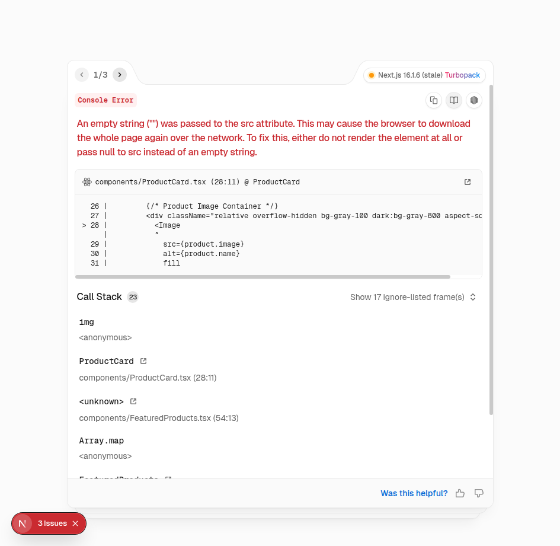
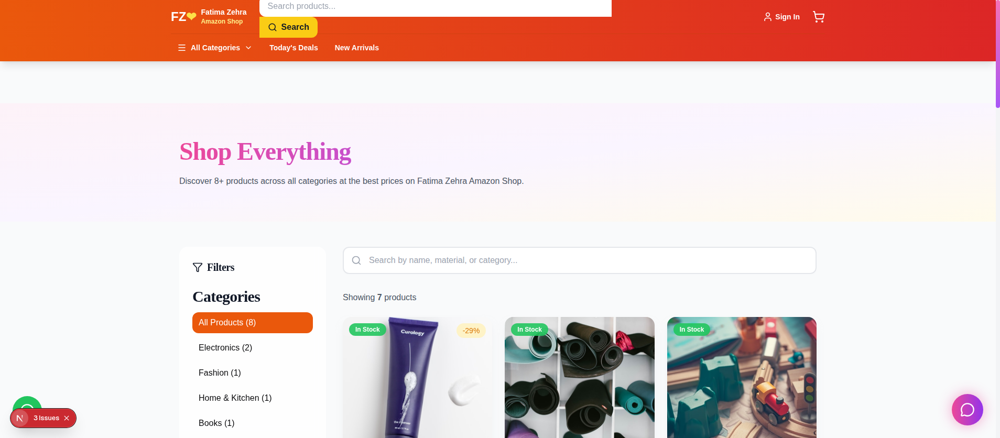
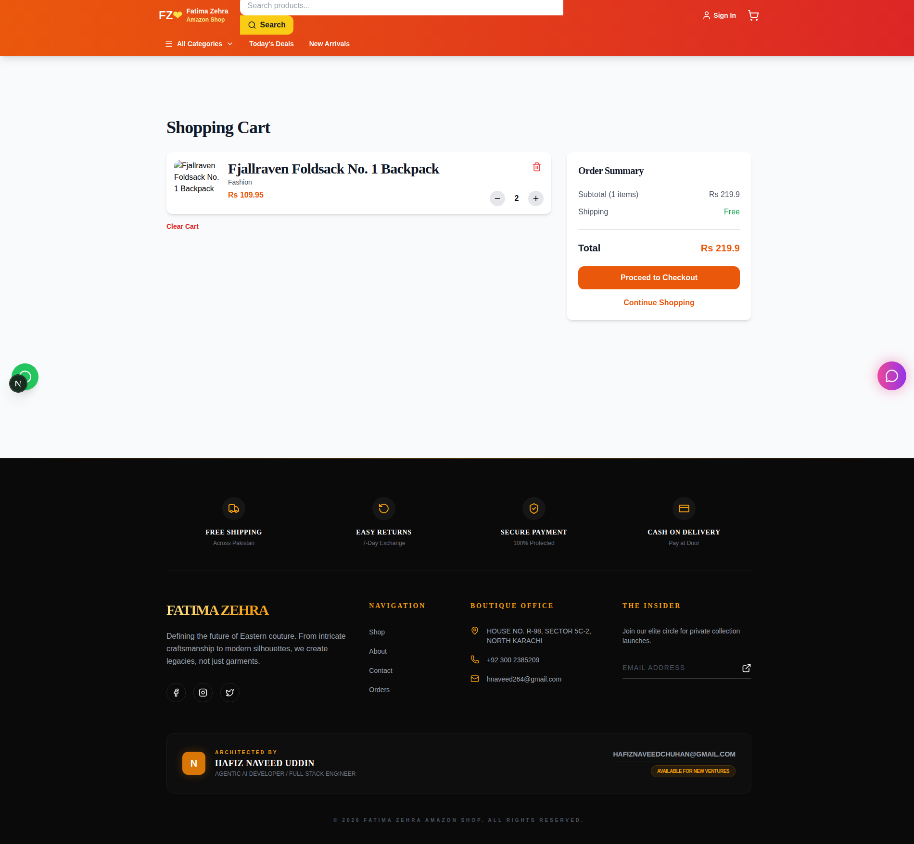
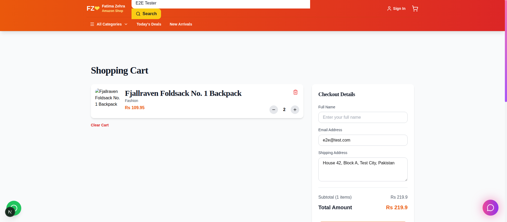
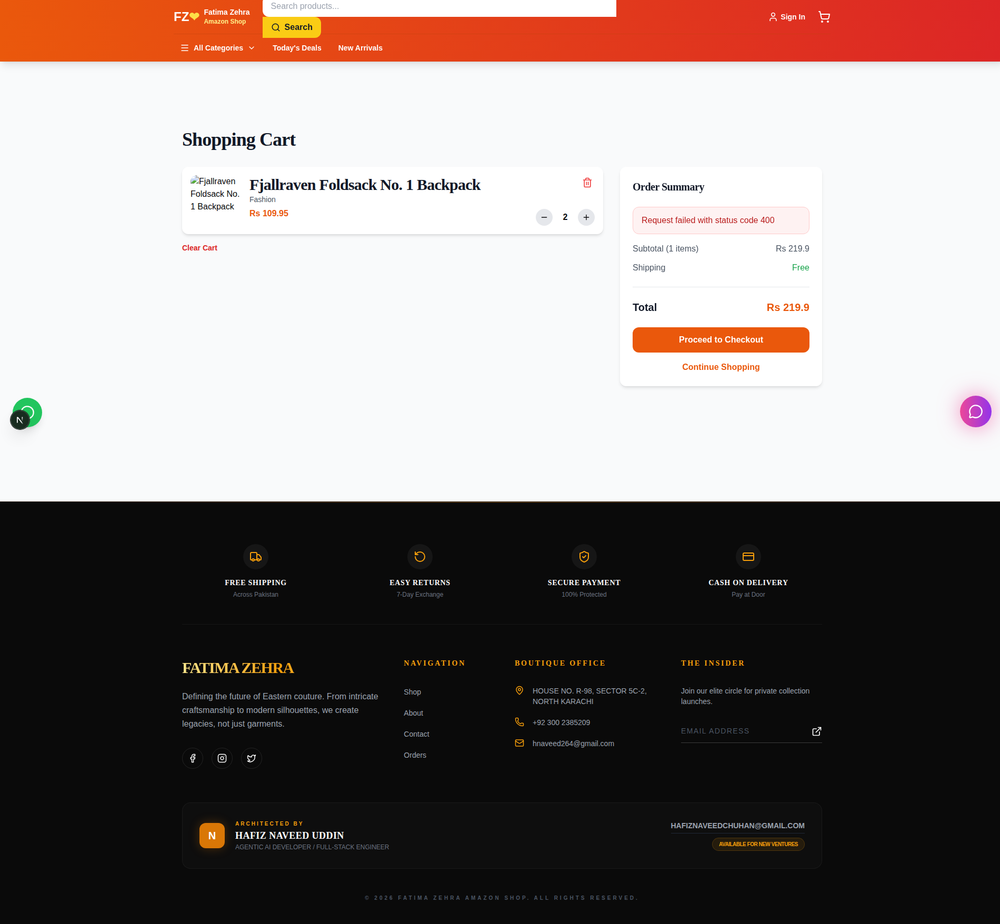
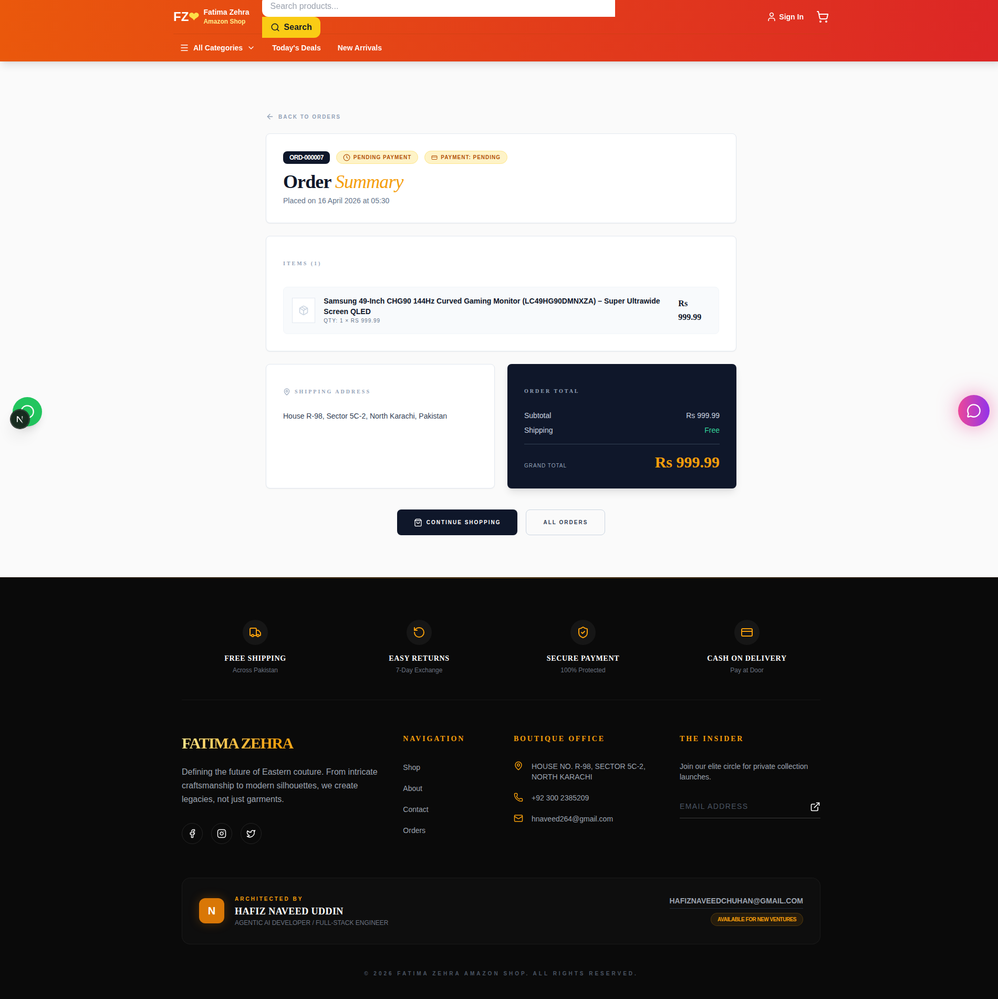
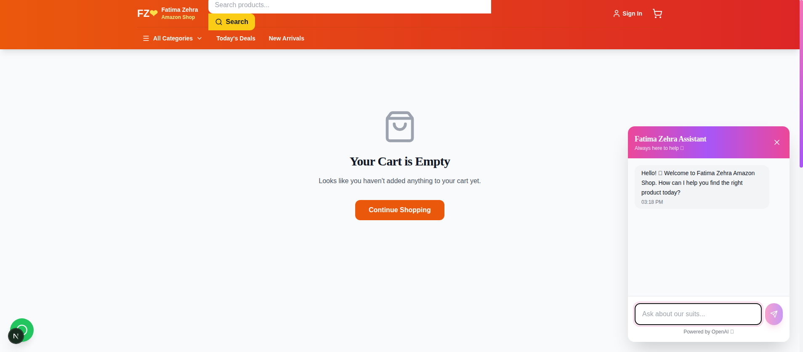
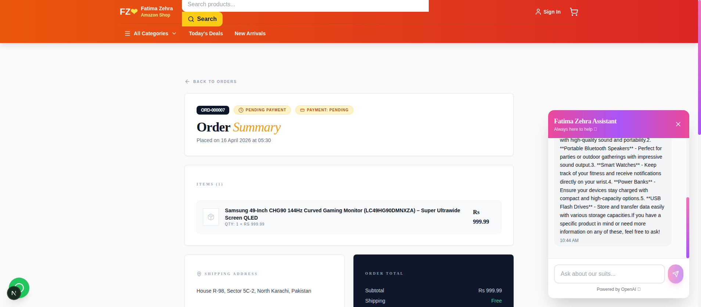
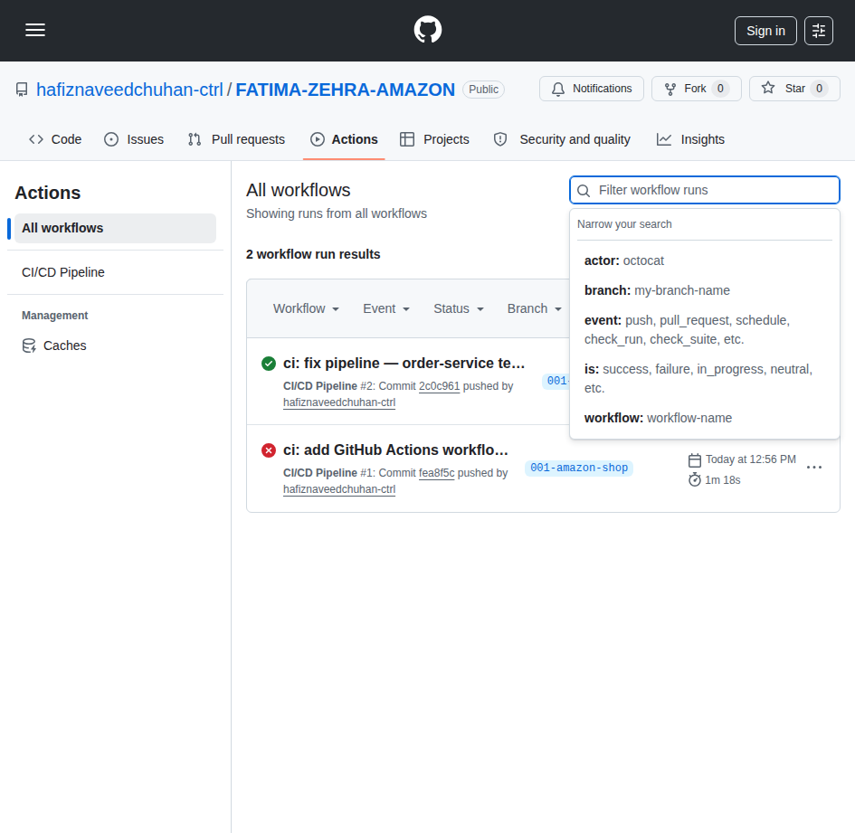

<div align="center">

# 🛒 Fatima Zehra Amazon Shop

### An Amazon-style, full-stack e-commerce platform powered by AI

*Next.js 16 · FastAPI Microservices · Neon PostgreSQL · Stripe · OpenAI*

[](https://github.com/hafiznaveedchuhan-ctrl/FATIMA-ZEHRA-AMAZON/actions)


<br/>



</div>

---

## ✨ Highlights

> A production-grade e-commerce reference build demonstrating **microservices**, **server-side rendering**, **serverless Postgres**, **live Stripe test payments**, and a **conversational AI assistant** — all wired together with Docker Compose and a GitHub Actions CI/CD pipeline.

| | |
|---|---|
| 🧱 **Architecture** | 4 decoupled FastAPI microservices + Next.js 16 SSR frontend |
| ☁️ **Data** | Neon serverless PostgreSQL via SQLModel ORM |
| 🔐 **Auth** | JWT + bcrypt, protected routes, httpOnly token flow |
| 💳 **Payments** | Stripe PaymentIntents (test mode) with Elements UI |
| 🤖 **AI** | Floating chat widget backed by OpenAI `gpt-4o-mini` |
| 🛍 **Catalog** | 84 real products across 7 categories, auto-seeded |
| 🐳 **Ops** | Dockerized services + GitHub Actions CI/CD |
| 🧪 **Quality** | pytest backend tests + Playwright E2E verification |

---

## 📸 Screenshots

<table>
  <tr>
    <td align="center"><strong>🏠 Homepage</strong><br/></td>
    <td align="center"><strong>🛍 Product Catalog</strong><br/></td>
  </tr>
  <tr>
    <td align="center"><strong>🛒 Cart</strong><br/></td>
    <td align="center"><strong>📋 Checkout</strong><br/></td>
  </tr>
  <tr>
    <td align="center"><strong>💳 Stripe Payment</strong><br/></td>
    <td align="center"><strong>✅ Order Detail</strong><br/></td>
  </tr>
  <tr>
    <td align="center"><strong>🤖 AI Chat</strong><br/></td>
    <td align="center"><strong>💬 OpenAI Reply</strong><br/></td>
  </tr>
</table>

---

## 🏛 Architecture

```
┌──────────────────────────────────────────────────────────────┐
│                    Browser (Next.js :3000)                   │
│            React 19 · Tailwind · shadcn/ui · Zustand         │
└────────────────────────────┬─────────────────────────────────┘
                             │
                     NGINX Gateway (:80)
                             │
         ┌───────────────────┼───────────────────┬───────────────────┐
         ▼                   ▼                   ▼                   ▼
  ┌────────────┐      ┌────────────┐      ┌────────────┐      ┌────────────┐
  │   user     │      │  product   │      │   order    │      │    chat    │
  │  :8001     │      │   :8002    │      │   :8003    │      │   :8004    │
  │ JWT+bcrypt │      │  Catalog   │      │Cart+Stripe │      │  OpenAI    │
  └─────┬──────┘      └─────┬──────┘      └─────┬──────┘      └─────┬──────┘
        │                   │                   │                   │
        └───────────┬───────┴───────────────────┘                   │
                    ▼                                               ▼
         ┌──────────────────────┐                         ┌──────────────────┐
         │ Neon PostgreSQL ☁️   │                         │   OpenAI API     │
         │  (serverless, SSL)   │                         │  gpt-4o-mini     │
         └──────────────────────┘                         └──────────────────┘
                                                          ┌──────────────────┐
                                                          │   Stripe API     │
                                                          │  (test mode)     │
                                                          └──────────────────┘
```

### 🔌 Service Matrix

| Service | Port | Responsibility | Key Endpoints |
|---|---|---|---|
| **user-service** | 8001 | Authentication, user profile | `POST /api/users/register`, `POST /api/users/login`, `GET /api/users/me` |
| **product-service** | 8002 | Product catalog, categories, search | `GET /api/products`, `GET /api/categories`, `GET /api/products/{id}` |
| **order-service** | 8003 | Cart, checkout, Stripe payments | `POST /api/cart/items`, `POST /api/checkout`, `POST /api/payments/create-intent`, `GET /api/orders/{id}` |
| **chat-service** | 8004 | AI conversational assistant | `POST /api/chat/messages`, `GET /api/chat/history` |
| **frontend** | 3000 | Next.js 16 SSR UI | Full App Router + shadcn/ui + Tailwind |

---

## 🧰 Tech Stack

<table>
<tr>
<td valign="top" width="33%">

### Frontend
- **Next.js 16** (App Router, Turbopack)
- **React 19**
- **TypeScript 5**
- **Tailwind CSS 3** + **shadcn/ui**
- **Radix UI** primitives
- **Zustand** state (persist middleware)
- **Stripe Elements** (`@stripe/react-stripe-js`)
- **lucide-react** icons
- **Axios** HTTP client

</td>
<td valign="top" width="33%">

### Backend
- **FastAPI** + **Pydantic v2**
- **Uvicorn** (ASGI)
- **SQLModel** (SQLAlchemy 2 + Pydantic)
- **psycopg2** Postgres driver
- **python-jose** (JWT)
- **passlib[bcrypt]** password hashing
- **stripe** Python SDK
- **openai** Python SDK

</td>
<td valign="top" width="33%">

### Platform
- **Neon PostgreSQL** (serverless)
- **Docker** + **docker-compose**
- **NGINX** reverse proxy
- **GitHub Actions** CI/CD
- **Trivy** image scanning
- **pytest** (backend unit/integration)
- **Playwright** (E2E browser tests)
- **Claude Code** AI pair-programming

</td>
</tr>
</table>

---

## 🚀 Quick Start

### Prerequisites
- **Docker** + **Docker Compose**, or **Node 20+** & **Python 3.11+**
- A **Neon** Postgres connection string
- **Stripe** test keys (`sk_test_*`, `pk_test_*`)
- **OpenAI** API key

### 1. Clone & configure env

```bash
git clone https://github.com/hafiznaveedchuhan-ctrl/FATIMA-ZEHRA-AMAZON.git
cd FATIMA-ZEHRA-AMAZON/learnflow-app

cp .env.backend.example .env.backend
cp app/frontend/.env.example app/frontend/.env.local
# Fill in DATABASE_URL, JWT_SECRET, STRIPE_SECRET_KEY,
# NEXT_PUBLIC_STRIPE_PUBLISHABLE_KEY, OPENAI_API_KEY
```

### 2. Option A — Docker Compose (recommended)

```bash
cd learnflow-app
docker-compose up --build
```

All services come up on their ports (3000, 8001-8004, 80 for NGINX).

### 2. Option B — Run locally without Docker

```bash
# Terminal 1 — Frontend
cd learnflow-app/app/frontend
npm install
npm run dev                       # http://localhost:3000

# Terminal 2 — user-service
cd learnflow-app/app/backend/user-service
pip install -r requirements.txt
uvicorn app.main:app --port 8001 --reload

# Repeat for product-service (8002), order-service (8003), chat-service (8004)
```

### 3. Seed the catalog

```bash
cd learnflow-app
python scripts/seed_products.py               # fakestoreapi + dummyjson → 60 products
python scripts/seed_missing_categories.py     # Books / Toys / Sports → 24 products
# Total: 84 products across 7 categories
```

### 4. Open & test

Visit **http://localhost:3000**, register an account, browse, add to cart, and pay with Stripe test card:

| Test Card | Expiry | CVC |
|---|---|---|
| `4242 4242 4242 4242` | any future date (e.g. `12/30`) | any 3 digits (`123`) |

---

## 🗂 Project Structure

```
FATIMA-ZEHRA-AMAZON/
├── .github/workflows/         # GitHub Actions CI/CD
├── docs/screenshots/          # README assets
├── history/                   # SpecKit prompts & ADRs
├── specs/                     # Spec-Driven Development artifacts
└── learnflow-app/
    ├── app/
    │   ├── backend/
    │   │   ├── user-service/       # FastAPI · auth
    │   │   ├── product-service/    # FastAPI · catalog
    │   │   ├── order-service/      # FastAPI · cart, orders, Stripe
    │   │   └── chat-service/       # FastAPI · OpenAI
    │   └── frontend/
    │       ├── app/                # Next.js App Router pages
    │       │   ├── auth/
    │       │   ├── cart/
    │       │   ├── orders/[id]/    # ← Dynamic order detail
    │       │   ├── products/
    │       │   └── profile/
    │       ├── components/         # Navbar, ProductCard, ChatWidget, StripeCheckoutForm...
    │       └── lib/                # api client, zustand stores, auth helpers
    ├── database/migrations/        # SQL schema
    ├── docker-compose.yml          # Full-stack dev compose
    ├── scripts/
    │   ├── seed_products.py
    │   └── seed_missing_categories.py
    └── k8s/                        # Kubernetes manifests (optional)
```

---

## 🧪 Testing

```bash
# Backend — each service has its own test suite
cd learnflow-app/app/backend/order-service && pytest -v

# Frontend — type-check + lint + build
cd learnflow-app/app/frontend
npm run type-check
npm run lint
npm run build

# Full E2E via Playwright (optional, via Claude Code MCP)
# Scenarios covered live:
# ✅ Register → Login → JWT issued
# ✅ Browse → filter by category → search
# ✅ Add to cart → checkout → Stripe PaymentIntent → /orders/[id]
# ✅ Chat widget → OpenAI reply
```

### Live E2E Verification

<div align="center">

<br/><em>Continuous Integration pipeline — build, lint, test, Docker, Trivy scan</em>
</div>

---

## 🛡 Security

- **No secrets in repo** — everything via `.env` (see `.gitignore`)
- **Passwords** stored as bcrypt hashes (never plaintext)
- **JWT** signed with `JWT_SECRET`, sent via `Authorization: Bearer <token>`
- **Stripe** runs in **test mode**; card data never touches our servers (PCI-safe Elements iframe)
- **SQL** parameterized via SQLModel — no string concatenation
- **Trivy** scans Docker images on every PR

---

## 🗺 Roadmap

- [x] Microservices skeleton + Neon integration
- [x] JWT auth + bcrypt
- [x] Product catalog (84 seeded items)
- [x] Cart + Zustand persistence
- [x] Stripe PaymentIntents + Elements
- [x] Order detail page `/orders/[id]`
- [x] OpenAI chat widget
- [x] GitHub Actions CI/CD
- [x] Docker Compose stack
- [ ] Stripe webhook handler (prod deployment)
- [ ] Qdrant + RAG for product-aware chat
- [ ] Admin dashboard
- [ ] Kubernetes Helm chart

---

## 📜 Spec-Driven Development

This project was built using **[SpecKit](https://github.com/spec-kit-plus/spec-kit-plus)** — every non-trivial decision is captured as a PHR (Prompt History Record) or ADR (Architecture Decision Record) under `history/`.

```
history/
├── adr/                        # Architecture Decision Records
└── prompts/
    ├── constitution/           # Project principles
    ├── fatima-zehra-amazon/    # Feature-specific prompts
    └── general/                # Cross-cutting conversations
```

---

## 👤 Author

<div align="center">

### **Hafiz Naveed Uddin**
*Agentic AI Developer · Full-Stack Engineer*

📧 [hafiznaveedchuhan@gmail.com](mailto:hafiznaveedchuhan@gmail.com) · 📍 Karachi, Pakistan

</div>

---

## 📄 License

Released under the **MIT License**. See [LICENSE](LICENSE) for details.

<div align="center">

---

**⭐ If this project helped you, please star the repo!**

*Built with ❤️ using Claude Code, Spec-Driven Development, and a lot of coffee.*

</div>
